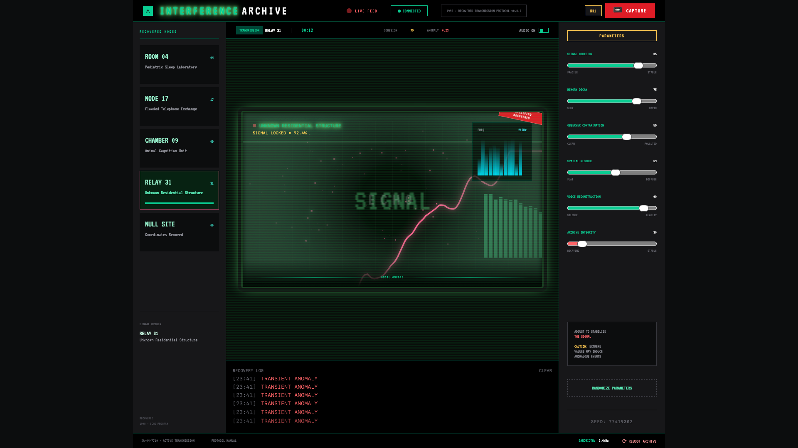

<div align="center">

# ⚠ INTERFERENCE ARCHIVE

**A generative audiovisual instrument disguised as a recovered-transmission terminal.**

Procedural Web Audio synthesis · real-time Canvas rendering · diegetic interface fiction — in a single static page, no build step, no dependencies to install.

[](https://zazieproductions.github.io/interference-archive/)
[](LICENSE)
[](https://developer.mozilla.org/docs/Web/API/Web_Audio_API)
[](https://developer.mozilla.org/docs/Web/API/Canvas_API)
[](#quick-start)
[](CONTRIBUTING.md)

<a href="https://zazieproductions.github.io/interference-archive/">
  
</a>

<strong><a href="https://zazieproductions.github.io/interference-archive/">▶ ENTER THE LIVE ARCHIVE</a></strong>

</div>

---

## Table of contents

- [Overview](#overview)
- [Why this project exists](#why-this-project-exists)
- [Live demo & screenshots](#live-demo--screenshots)
- [The experience in 60 seconds](#the-experience-in-60-seconds)
- [Feature matrix](#feature-matrix)
- [Quick start](#quick-start)
- [Architecture at a glance](#architecture-at-a-glance)
- [The signal chain](#the-signal-chain)
- [Parameter model](#parameter-model)
- [Controls & shortcuts](#controls--shortcuts)
- [Project structure](#project-structure)
- [Tech stack & rationale](#tech-stack--rationale)
- [Documentation](#documentation)
- [Quality: testing, performance, accessibility](#quality-testing-performance-accessibility)
- [Deployment](#deployment)
- [Roadmap](#roadmap)
- [Contributing](#contributing)
- [Design language](#design-language)
- [Credits & license](#credits--license)

---

## Overview

**Interference Archive** is an interactive browser artwork that treats the web page as a **speculative instrument**. It presents itself as a late-1990s archival console used to recover unstable transmissions from abandoned research sites. Every control simultaneously reshapes three coupled systems:

1. **Sound** — an evolving drone generated live with the Web Audio API.
2. **Image** — a real-time oscilloscope, spectrogram, and particle field drawn on a Canvas.
3. **Fiction** — the implied state of the archive, expressed through telemetry, logs, classifications, and generated case files.

It is deliberately *not* a music player or a game. There are no audio files, no levels, and no win state. The signal is synthesized from first principles in the browser, and the "horror" is systemic: the machine looks orderly while its own readouts imply that something it is measuring cannot be contained by the interface built to observe it.

> All locations, events, transmissions, and reports are fictional. All audiovisual output is generated procedurally at runtime.

## Why this project exists

This repository is a portfolio piece for creative-technology work, and it is intentionally scoped to demonstrate breadth across disciplines that rarely appear together in one codebase:

| Discipline | What it demonstrates here |
| --- | --- |
| **Creative coding** | A hand-written `requestAnimationFrame` render loop driving procedural particles, oscilloscope traces, spectrogram bars, grid, vignette, and scanlines on a raw Canvas 2D context. |
| **DSP / browser audio** | A fully wired Web Audio graph — oscillators, a looped noise buffer, a biquad filter, a delay/feedback network, an analyser, and a master bus — modulated in real time. |
| **Interaction design** | DAW-style parameter sliders, node selection, mute/power state machines, keyboard shortcuts, and live telemetry that reads back into the visuals. |
| **Systems & narrative** | Site-specific fiction, anomaly logs, randomized incident reports, and generated, downloadable "case files." |
| **Diegetic interface design** | The UI *is* the story: status indicators, typography, and failure states carry the worldbuilding, not a separate narrative layer. |
| **Zero-dependency engineering** | Ships as three static files. No bundler, no framework, no server, no `node_modules`. Loads instantly and is trivial to host. |

If you are evaluating this repo as a recruiter or collaborator, the fastest tour is: read this README, skim [`docs/ARCHITECTURE.md`](docs/ARCHITECTURE.md), then open [`assets/js/app.js`](assets/js/app.js) alongside the [API reference](docs/API_REFERENCE.md).

## Live demo & screenshots

- **Live:** https://zazieproductions.github.io/interference-archive/
- The console runs entirely client-side. Audio only begins after a user gesture (a browser autoplay requirement), so the experience opens on a "CLICK TO ACCESS" gate.


## The experience in 60 seconds

1. **Initialize** the archive to unlock the audio engine (satisfies the browser autoplay gesture requirement).
2. **Move between recovered nodes** — each has a distinct fictional identity, accent color, base frequency, and log vocabulary.
3. **Adjust transmission parameters** to reshape the coupled audio + visual system in real time.
4. **Randomize** the console to jump to an unstable new state.
5. **Capture a transmission** to mint a unique archive ID, freeze the current frame, and auto-write a classification and incident report.
6. **Download the case file** as a paired `.txt` report and `.png` snapshot.

## Feature matrix

- Procedural Web Audio signal chain (oscillator bank + noise + filter + delay/feedback)
- Dynamically generated white-noise buffer (`AudioBuffer`)
- Parameter-driven oscillator, filter, delay, and gain behavior with smoothed transitions
- Real-time Canvas 2D animation via `requestAnimationFrame`
- `AnalyserNode`-driven oscilloscope waveform and spectrogram bars
- Particle field whose motion responds to live audio energy
- Five site "personalities" with per-site synthesis and narrative parameters
- Randomized narrative event generation (logs, anomalies, incident reports)
- Canvas snapshot export via `toDataURL()`
- Client-side text-file generation via `Blob` + object URLs
- Keyboard shortcuts for capture and randomization
- CRT/terminal aesthetic (scanlines, glow, glitch) in pure CSS
- Responsive single-page layout, zero external state or backend

## Quick start

The project is fully static. The fastest path:

```bash
git clone https://github.com/zazieproductions/interference-archive.git
cd interference-archive
```

Then either open `index.html` directly, or (recommended, for consistent browser behavior) serve it locally:

```bash
# Python 3
python3 -m http.server 8000

# …or Node
npx serve .
```

Visit **http://localhost:8000** and click to initialize. Audio starts only after that first gesture — this is intentional and matches how modern browsers gate autoplaying sound.

> No installation, build, or environment variables are required to run the piece — there are no runtime dependencies to install. `package.json` carries metadata and keywords, plus one dev-only dependency (`@playwright/test`) for the smoke suite below.

See [`docs/SETUP.md`](docs/SETUP.md) for browser support notes and troubleshooting.

## Architecture at a glance

Three files, three responsibilities, one coupled system:

```
                          ┌──────────────────────────────────────────┐
   User gesture  ─────────▶            index.html (shell)             │
   (click / key)          │  markup · Tailwind CDN · VT323 font       │
                          └───────────────┬──────────────────────────┘
                                          │ loads
                          ┌───────────────▼──────────────────────────┐
                          │            assets/js/app.js               │
                          │  ┌───────────┐  ┌──────────┐  ┌────────┐  │
                          │  │  Audio    │◀▶│  State    │◀▶│ Render │  │
                          │  │  engine   │  │  (params, │  │ loop   │  │
                          │  │(Web Audio)│  │  site,    │  │(Canvas │  │
                          │  └─────┬─────┘  │  power)   │  │  2D)   │  │
                          │        │        └────┬─────┘  └───┬────┘  │
                          │   AnalyserNode ───────┴────────────┘       │
                          └────────────────────────┬──────────────────┘
                                                    │ styles
                          ┌─────────────────────────▼─────────────────┐
                          │           assets/css/styles.css            │
                          │  CRT scanlines · neon glow · glitch · font │
                          └────────────────────────────────────────────┘
```

The `AnalyserNode` is the bridge: it taps the live audio bus and feeds time-domain and frequency-domain data back into the render loop, so the picture is literally a view of the sound. Full detail — module boundaries, data flow, and lifecycle — lives in [`docs/ARCHITECTURE.md`](docs/ARCHITECTURE.md).

## The signal chain

The audio graph is built once in `initAudio()` and modulated continuously thereafter:

```
 osc0 (sine 85Hz) ─▶ gain ┐
 osc1 (sine 128Hz)─▶ gain ┤
 osc2 (sine 210Hz)─▶ gain ├─▶ droneMix ┐
 osc3 (saw 340Hz) ─▶ gain ┘             │
                                        ├─▶ biquad LOWPASS ─▶ delay ─┬─(dry)───────────────────────────┐
 noiseBuffer ─▶ noiseSource ─▶ noiseGain ┘        ▲            │      │                               │
                                                  │            │      └─▶ residue wet path ────────────┤
                                                  │            │           (convolver + stereo taps)  │
                                                  │            └─▶ feedbackGain ─┐                    │
                                                  │                              │                    ▼
                                                  └───────────────(feedback)────┘         analyser ─▶ master ─▶ 🔈
```

- **Oscillator bank** — three sine partials and one sawtooth "voice," each with its own gain, summed into a drone mix.
- **Noise layer** — a 4-second looped white-noise `AudioBuffer` provides the "contamination" texture.
- **Biquad lowpass filter** — the tonal gate; its cutoff is the most audible parameter target.
- **Delay + feedback** — a recirculating delay (`delay → feedbackGain → delay`, plus a tap back into the filter) creates the haunted, smeared tail.
- **Spatial Residue stage** — a feed-forward wet path tapped off the delay: a procedurally generated 1.8 s stereo impulse-response convolver plus decorrelated, panned early-reflection taps. Band-limited, quiet, and never fed back into the loop; at 0 it is a pure bypass of the dry signal.
- **AnalyserNode** — non-destructive tap that drives the visuals.
- **Master gain** — final level, ramped for power/mute transitions.

A complete node-by-node breakdown with default values is in [`docs/AUDIO_ENGINE.md`](docs/AUDIO_ENGINE.md).

## Parameter model

Six normalized parameters (0–100) are mapped to audio targets with smoothed `setTargetAtTime` transitions so nothing clicks or zippers:

| Parameter | UI range | Primary audio target |
| --- | --- | --- |
| **Signal Cohesion** | fragile ↔ stable | Oscillator frequency spread + filter cutoff |
| **Memory Decay** | slow ↔ rapid | Delay time + feedback amount |
| **Observer Contamination** | clean ↔ polluted | Noise-layer gain |
| **Spatial Residue** | flat ↔ diffuse | Wet-path room + stereo width: convolver level (`residue²`), tap gain, early-tap spacing (12–51 ms) and pan spread (±0.35–0.9); also drives the visual afterimage |
| **Voice Reconstruction** | silence ↔ clarity | Filter cutoff bias + "voice" oscillator modulation depth |
| **Archive Integrity** | decaying ↔ stable | Oscillator gain + master level |

The exact transfer functions (e.g. `cutoff = 400 + cohesion·18 + voice·8`, clamped to 4200 Hz) are documented in [`docs/AUDIO_ENGINE.md`](docs/AUDIO_ENGINE.md#parameter-mapping).

## Controls & shortcuts

| Control | Action |
| --- | --- |
| **Initialize overlay** | Unlocks the audiovisual engine (required user gesture) |
| **Recovered Nodes** | Switches the active fictional site and its synthesis profile |
| **Parameter sliders** | Reshapes the live signal and system behavior |
| **Randomize Parameters** | Generates a new unstable parameter state |
| **Audio toggle** | Mutes / restores output (ramped, never hard-cut) |
| **Power** | Transitions the archive between `CONNECTED` and `OFFLINE` |
| **Capture** | Snapshots the Canvas and generates a fictional case file |
| **Download .CASE** | Saves a paired `.txt` + `.png` artifact |
| <kbd>Cmd/Ctrl</kbd> + <kbd>K</kbd> | Randomize parameters |
| <kbd>/</kbd> | Capture a transmission |

## Project structure

```text
interference-archive/
├── index.html                 # Single-page shell: markup, meta, CDN + asset links
├── assets/
│   ├── css/
│   │   └── styles.css          # CRT scanlines, neon glow, glitch, VT323 font
│   ├── js/
│   │   └── app.js              # Audio engine, render loop, state, capture/export
│   └── interference-archive-preview.png
├── docs/                       # Deep technical documentation (see below)
├── tests/
│   └── smoke.spec.js           # Playwright smoke suite (dev-only, run with `npm test`)
├── .github/                    # Issue/PR templates (CI snippet in docs/TESTING.md)
├── CONTRIBUTING.md
├── CODE_OF_CONDUCT.md
├── SECURITY.md
├── CHANGELOG.md
├── LICENSE
├── package.json                # Scripts + metadata; no runtime dependencies
├── playwright.config.js        # Chromium smoke-test config (dev-only)
└── README.md
```

## Tech stack & rationale

| Choice | Why |
| --- | --- |
| **Vanilla JS (no framework)** | The app is one render loop plus one audio graph. A framework's diffing model adds overhead and abstraction with no payoff for imperative Canvas/audio work. Zero dependencies = zero supply-chain surface and instant loads. |
| **Web Audio API** | Sample-accurate scheduling and a real DSP node graph, natively, with no audio assets to ship. |
| **Canvas 2D (not WebGL)** | The visuals are line/particle/text work at 720×420; Canvas 2D is the right complexity-to-fidelity tradeoff. WebGL is on the [roadmap](docs/ROADMAP.md) for shader-based post-processing. |
| **Tailwind via CDN** | Lets the shell stay a single hand-authored HTML file while keeping layout declarative. Production hardening (pinning/self-hosting) is tracked on the roadmap. |
| **VT323 (Google Fonts)** | A period-accurate bitmap terminal face that sells the diegetic 1990s console. |
| **Static hosting (GitHub Pages)** | No backend means no server state to secure, scale, or pay for. |

The longer-form reasoning, including trade-offs we explicitly rejected, is recorded as decision records in [`docs/DESIGN_DECISIONS.md`](docs/DESIGN_DECISIONS.md).

## Documentation

| Document | What's inside |
| --- | --- |
| [`docs/ARCHITECTURE.md`](docs/ARCHITECTURE.md) | Module map, data flow, lifecycle, and coupling model |
| [`docs/AUDIO_ENGINE.md`](docs/AUDIO_ENGINE.md) | The full Web Audio graph and parameter transfer functions |
| [`docs/RENDERING.md`](docs/RENDERING.md) | The Canvas render loop, layers, and analyser bridge |
| [`docs/API_REFERENCE.md`](docs/API_REFERENCE.md) | Every function, its signature, and side effects |
| [`docs/COMPONENTS.md`](docs/COMPONENTS.md) | The UI regions and the DOM contract they rely on |
| [`docs/SETUP.md`](docs/SETUP.md) | Local dev, browser support, troubleshooting |
| [`docs/TESTING.md`](docs/TESTING.md) | Test strategy and manual QA checklist |
| [`docs/PERFORMANCE.md`](docs/PERFORMANCE.md) | Budgets, hot paths, and profiling notes |
| [`docs/ACCESSIBILITY.md`](docs/ACCESSIBILITY.md) | Current state, known gaps, and the a11y plan |
| [`docs/DEPLOYMENT.md`](docs/DEPLOYMENT.md) | Publishing to GitHub Pages and alternatives |
| [`docs/DESIGN_DECISIONS.md`](docs/DESIGN_DECISIONS.md) | Architecture decision records (ADRs) |
| [`docs/ROADMAP.md`](docs/ROADMAP.md) | Where this is going |

## Quality: testing, performance, accessibility

- **Testing** — A committed Playwright smoke suite (`npm test`, ~25s) asserts the boot sequence, the Spatial Residue audio/visual coupling, all six parameter mappings, mute/power gating, site presets, and the capture/download flow against the real page. It is complemented by a documented manual QA matrix for the perceptual checks and static checks (HTML validation, link checking) for CI. See [`docs/TESTING.md`](docs/TESTING.md).
- **Performance** — The render loop targets 60 fps at 720×420. Per-frame work is bounded (fixed particle count, fixed analyser bins, no per-frame allocations in the hot path). Budgets and profiling guidance are in [`docs/PERFORMANCE.md`](docs/PERFORMANCE.md).
- **Accessibility** — The piece is inherently visual/auditory, but the interface can still be made far more inclusive. Current status, honest known gaps (keyboard focus order, ARIA on the custom controls, `prefers-reduced-motion`), and the remediation plan are in [`docs/ACCESSIBILITY.md`](docs/ACCESSIBILITY.md).

## Deployment

Deployed as a static site on **GitHub Pages** — push to the default branch and serve the repository root. Because there is no build step, "deploy" is "publish these three files." Full instructions and alternatives (Netlify, Cloudflare Pages, any static host) are in [`docs/DEPLOYMENT.md`](docs/DEPLOYMENT.md).

## Roadmap

Highlights (full list in [`docs/ROADMAP.md`](docs/ROADMAP.md)):

- FFT-driven visuals wired directly from `AnalyserNode` frequency bins
- Microphone / line-input analysis mode
- Seeded, reproducible generation
- Persistent archive history via IndexedDB
- Exportable audio recordings (`MediaRecorder`)
- WebGL shader post-processing and an installation/kiosk mode

## Contributing

Contributions, experiments, and forks are welcome. Start with [`CONTRIBUTING.md`](CONTRIBUTING.md) for workflow, coding conventions, and the areas where help is most useful, and please follow the [`CODE_OF_CONDUCT.md`](CODE_OF_CONDUCT.md). Security reports go through [`SECURITY.md`](SECURITY.md).

## Design language

The interface draws from CRT terminals, scientific instrumentation, analog surveillance, archival media, numbers stations, abandoned institutional technology, and the administrative aesthetics of classified documentation. The horror is primarily *systemic*: the machine appears orderly while its measurements and generated reports imply that something cannot be contained by the interface built to observe it.

## Credits & license

Built by **Zazie Productions**. Released under the [MIT License](LICENSE).

Third-party runtime dependencies loaded via CDN: [Tailwind CSS](https://tailwindcss.com) and the [VT323](https://fonts.google.com/specimen/VT323) typeface (Google Fonts). All audio and imagery is generated in the browser.
